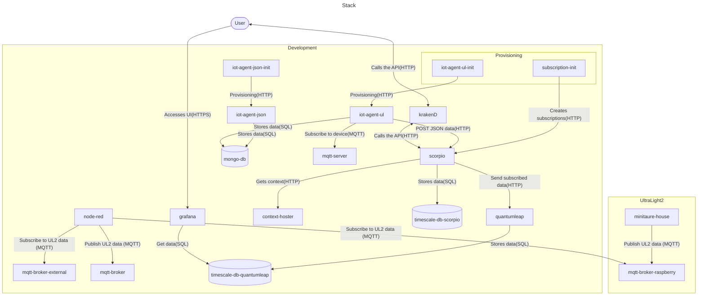

# Trainings Case ( Miniature House)

## Architecture

```mermaid
---
title: Stack
---
graph TD
    subgraph UltraLight2
        minitaure-house --> |"Publish UL2 data (MQTT)"| mqtt-broker-raspberry
    end
    subgraph Development
            node-red --> |"Subscribe to UL2 data (MQTT)"| mqtt-broker-raspberry
            node-red --> |"Subscribe to UL2 data (MQTT)"| mqtt-broker-external
            node-red --> |"Publish UL2 data (MQTT)"| mqtt-broker
            scorpio -->|"Send subscribed data(HTTP)"| quantumleap
            scorpio --> |"Gets context(HTTP)"| context-hoster
            scorpio -->|"Stores data(SQL)"| timescale-db-scorpio[(timescale-db-scorpio)]
            quantumleap -->|"Stores data(SQL)"| timescale-db-quantumleap[(timescale-db-quantumleap)]
            iot-agent-json --> |"Stores data(SQL)"| mongo-db[(mongo-db)]
            iot-agent-ul --> |"Stores data(SQL)"| mongo-db[(mongo-db)]
            subscription-init -->|"Creates subscriptions(HTTP)"| scorpio
            iot-agent-json-init -->|"Provisioning(HTTP)"| iot-agent-json
            iot-agent-ul-init -->|"Provisioning(HTTP)"| iot-agent-ul
            subgraph Provisioning
                subscription-init
                iot-agent-ul-init
            end
            iot-agent-ul --> |"POST JSON data(HTTP)"| scorpio
            iot-agent-ul --> |"Subscribe to device(MQTT)"| mqtt-server
            grafana -->|"Get data(SQL)"| timescale-db-quantumleap[(timescale-db-quantumleap)]
            krakenD <-->|"Calls the API(HTTP)"| scorpio

    end
    user([User]) -->|"Accesses UI(HTTPS)"| grafana
    user <--->|"Calls the API(HTTP)"| krakenD
```
